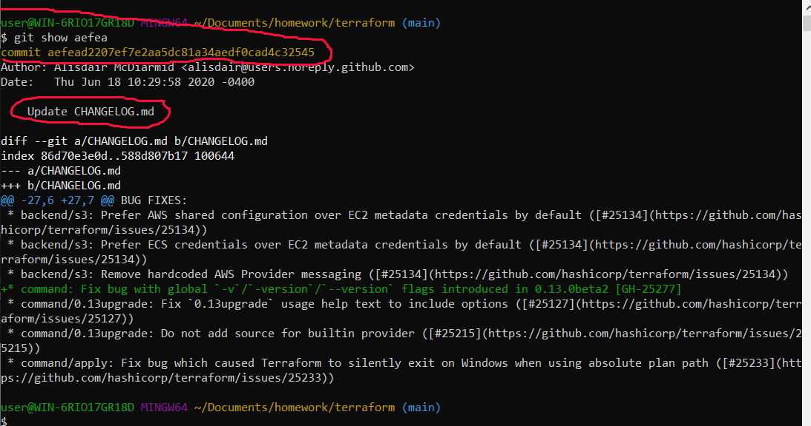
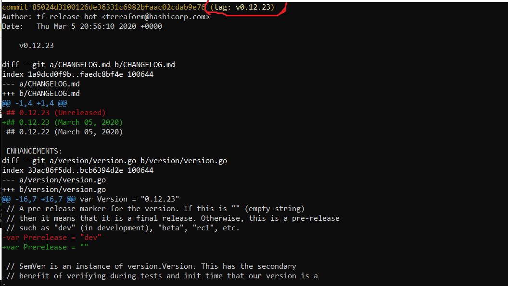
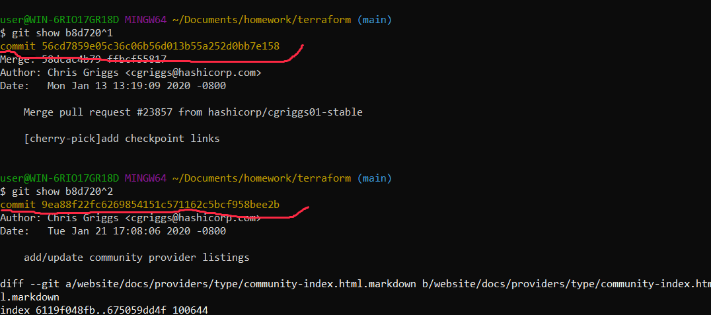
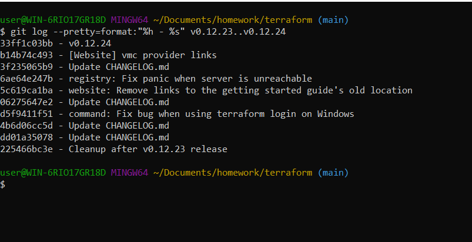
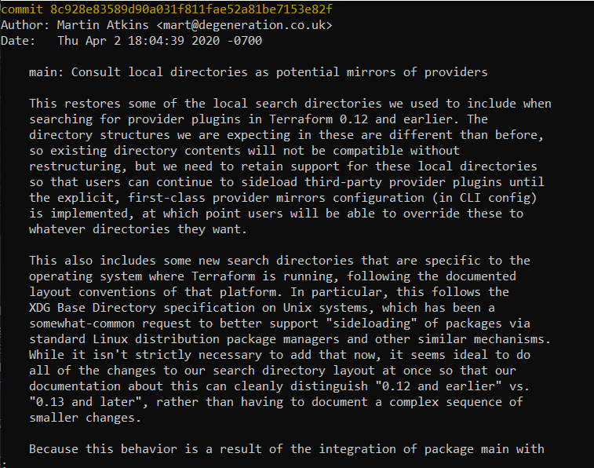
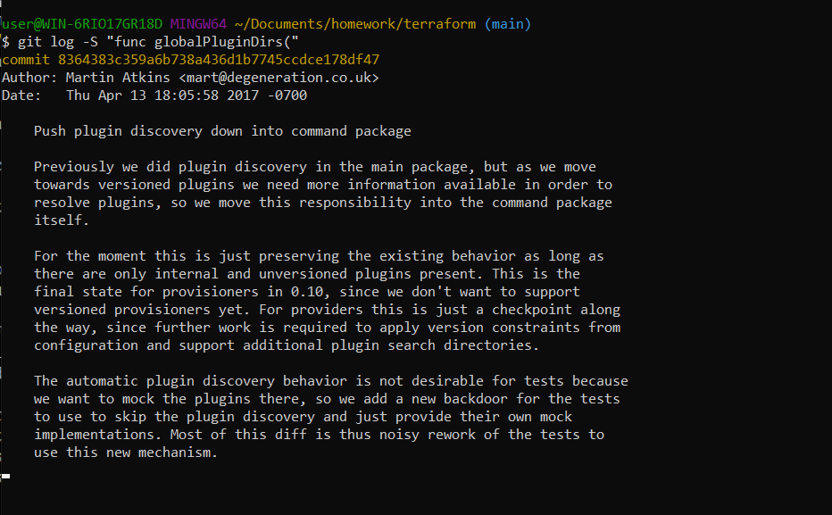
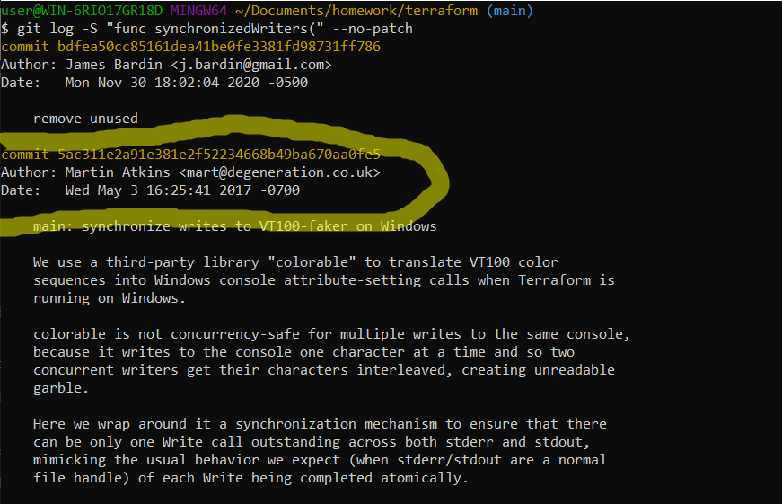

# `Домашнее задание к занятию «Инструменты Git» - Зозуля Максим`

------

## Задание

В клонированном репозитории:

1. Найдите полный хеш и комментарий коммита, хеш которого начинается на `aefea`.


2. Ответьте на вопросы.

* Какому тегу соответствует коммит `85024d3`?


* Сколько родителей у коммита `b8d720`? Напишите их хеши.


* Перечислите хеши и комментарии всех коммитов, которые были сделаны между тегами  v0.12.23 и v0.12.24.

```
$ git log v0.12.23..v0.12.24
commit 33ff1c03bb960b332be3af2e333462dde88b279e (tag: v0.12.24)
Author: tf-release-bot <terraform@hashicorp.com>
Date:   Thu Mar 19 15:04:05 2020 +0000

    v0.12.24

commit b14b74c4939dcab573326f4e3ee2a62e23e12f89
Author: Chris Griggs <cgriggs@hashicorp.com>
Date:   Tue Mar 10 08:59:20 2020 -0700

    [Website] vmc provider links

commit 3f235065b9347a758efadc92295b540ee0a5e26e
Author: Alisdair McDiarmid <alisdair@users.noreply.github.com>
Date:   Thu Mar 19 10:39:31 2020 -0400

    Update CHANGELOG.md

commit 6ae64e247b332925b872447e9ce869657281c2bf
Author: Alisdair McDiarmid <alisdair@users.noreply.github.com>
Date:   Thu Mar 19 10:20:10 2020 -0400

    registry: Fix panic when server is unreachable

    Non-HTTP errors previously resulted in a panic due to dereferencing the
    resp pointer while it was nil, as part of rendering the error message.
    This commit changes the error message formatting to cope with a nil
    response, and extends test coverage.

    Fixes #24384

commit 5c619ca1baf2e21a155fcdb4c264cc9e24a2a353
Author: Nick Fagerlund <nick.fagerlund@gmail.com>
Date:   Wed Mar 18 12:30:20 2020 -0700

    website: Remove links to the getting started guide's old location

    Since these links were in the soon-to-be-deprecated 0.11 language section, I
    think we can just remove them without needing to find an equivalent link.

commit 06275647e2b53d97d4f0a19a0fec11f6d69820b5
Author: Alisdair McDiarmid <alisdair@users.noreply.github.com>
Date:   Wed Mar 18 10:57:06 2020 -0400

    Update CHANGELOG.md

commit d5f9411f5108260320064349b757f55c09bc4b80
Author: Alisdair McDiarmid <alisdair@users.noreply.github.com>
Date:   Tue Mar 17 13:21:35 2020 -0400

    command: Fix bug when using terraform login on Windows

commit 4b6d06cc5dcb78af637bbb19c198faff37a066ed
Author: Pam Selle <pam@hashicorp.com>
Date:   Tue Mar 10 12:04:50 2020 -0400

    Update CHANGELOG.md

commit dd01a35078f040ca984cdd349f18d0b67e486c35
Author: Kristin Laemmert <mildwonkey@users.noreply.github.com>
Date:   Thu Mar 5 16:32:43 2020 -0500

    Update CHANGELOG.md

commit 225466bc3e5f35baa5d07197bbc079345b77525e
Author: tf-release-bot <terraform@hashicorp.com>
Date:   Thu Mar 5 21:12:06 2020 +0000

    Cleanup after v0.12.23 release
```
Или кратко




* Найдите коммит, в котором была создана функция `func providerSource`, её определение в коде выглядит так: `func providerSource(...)` (вместо троеточия перечислены аргументы).


* Найдите все коммиты, в которых была изменена функция `globalPluginDirs`.


* Кто автор функции `synchronizedWriters`? 



